import RainbowText from '@site/src/components/RainbowText';

# Generative AI Projects

## Software applications

### Using generative AI in software applications

Supervised learning for restaurant reputation monitoring

Using supervised learning, collecting a large amount of data, labeling it, the AI team trains AI models based on this data, and deploys them to cloud servers.

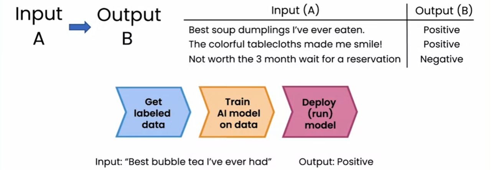

Prompt-based development

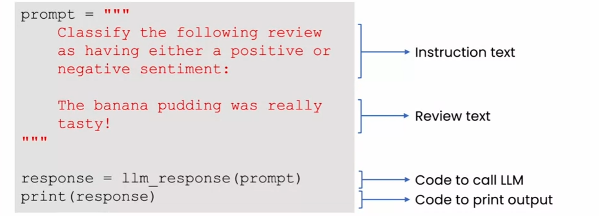

### Trying generative AI code yourself

[activity](https://learn.deeplearning.ai/genai4e/lesson/1/activity1)

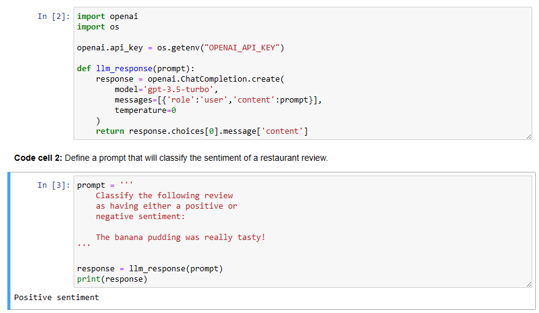

### Lifecycle of a generative AI project

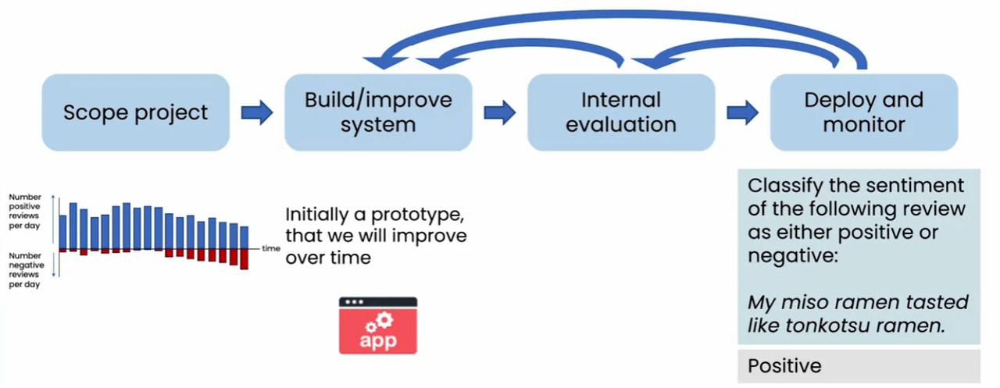

Cost intuition

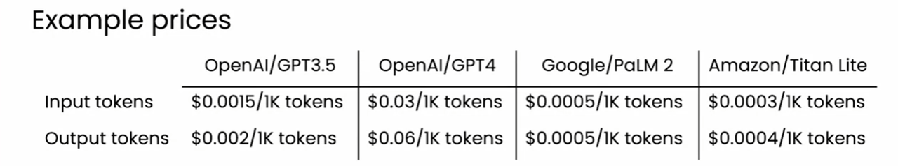

What is a token?

- <RainbowText texts={[{content: 'hello world'}]} /> 1 token
- <RainbowText texts={[{content: 'tran'}, {content: 'slate'}]} /> 2 tokens
- <RainbowText texts={[{content: 'ton'}, {content: 'k'}, {content: 'ots'}, {content: 'u'}]} /> 4 tokens

Roughly, 1 token = 3/4 words

## Advanced technologies: Beyond prompting

### Retrieval Augmented Generation (RAG)

Significantly expanding capabilities by providing data beyond the internet or other open sources.

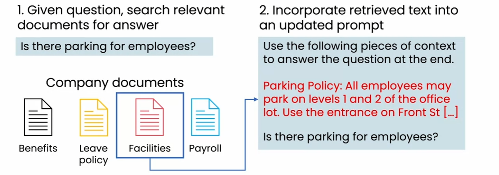

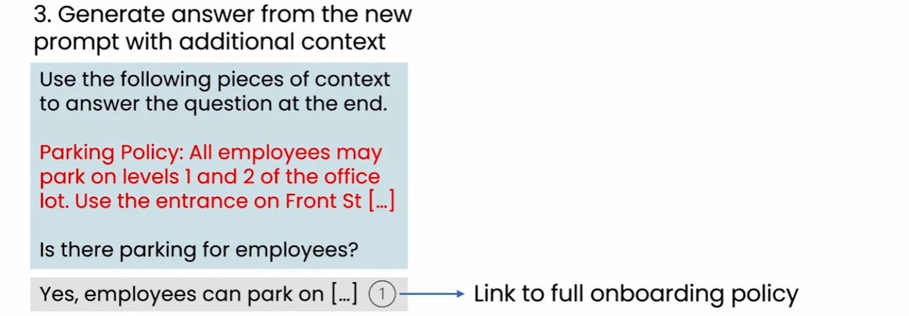

LLM as reasoning engine

### Fine-tuning

- Summarize in certain style or structure
- Minicking a writing or speaking style

Fine-tune: to help LLM gain specific knowledge

### Pretraining an LLM

Very expensive, but effective.

### Choosing a model

Model size:
| size | description | case |
| --- | --- | --- |
| 1B parameters | Pattern matching and basic knowledge of the world. | Restaurant review sentiment|
| 10B parameters | Greater world knowledge. Can follow basic instructions. | Food order chatbot|
| 100B+ | Rich world knowledge. Complex reasoning. | Brainstorming partner|

Closed or open source:

| Closed-source models (Cloud programming interface)                                                           | Open-source models                                                                                             |
| ------------------------------------------------------------------------------------------------------------ | -------------------------------------------------------------------------------------------------------------- |
| Easy to use in applications; More large/powerful models; Relatively inexpensive; Some risk of vendor lock-in | Full control over model; Can run on your own device (on-prem, PC, etc.); Full control over data privacy/access |

### How LLMs follow instructions

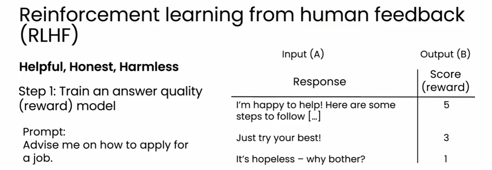

Tool use and agents

Tool use for food order taking

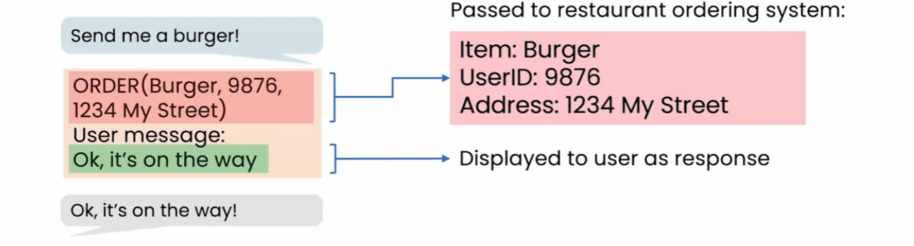

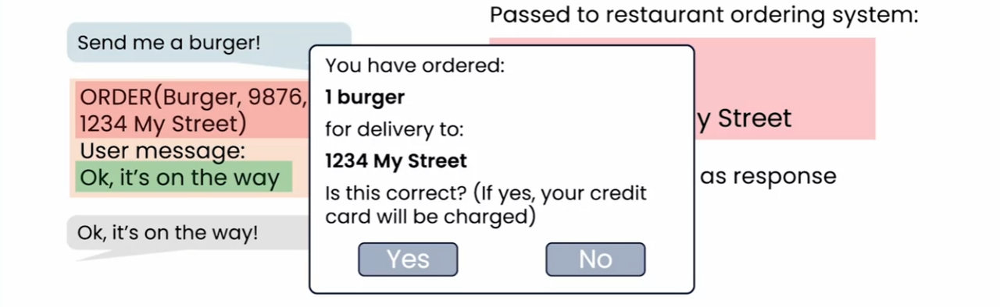

Tools for reasoning

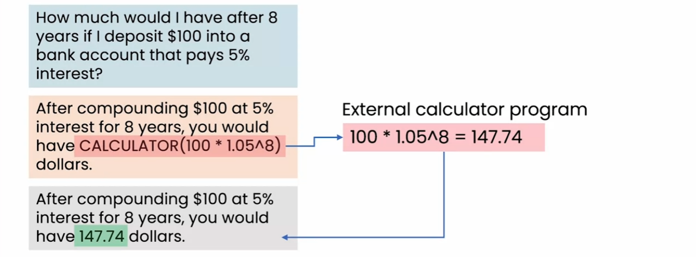

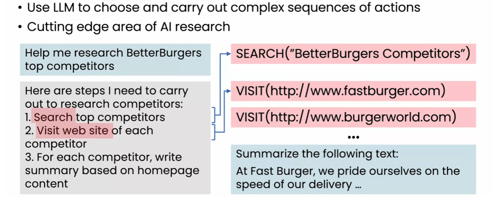
