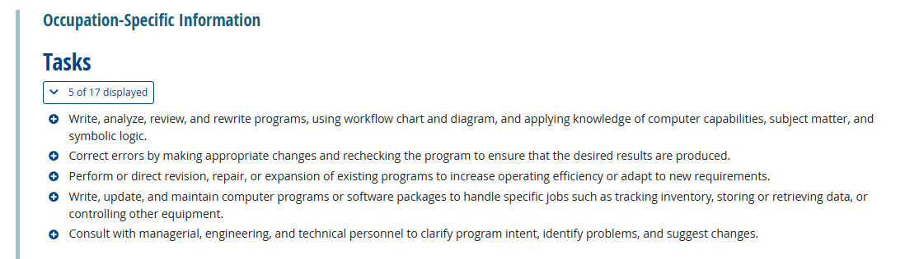
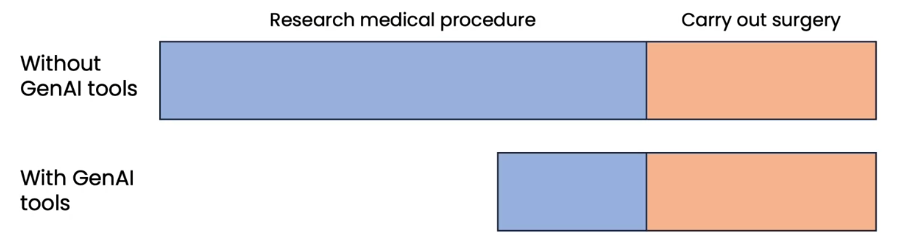
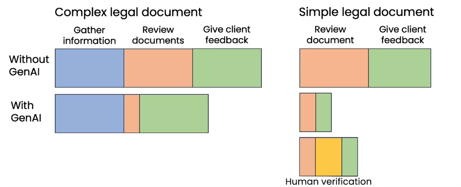
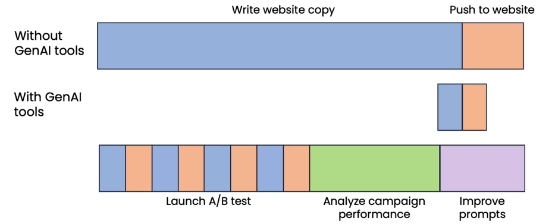
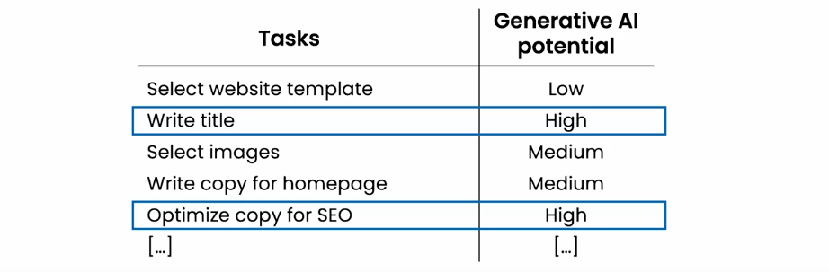
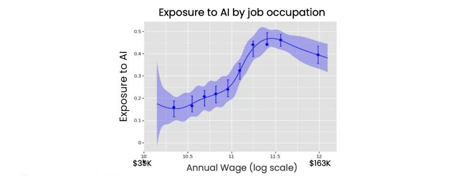
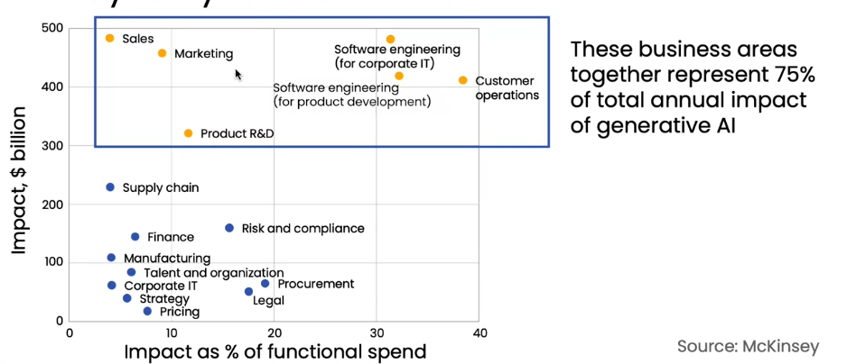
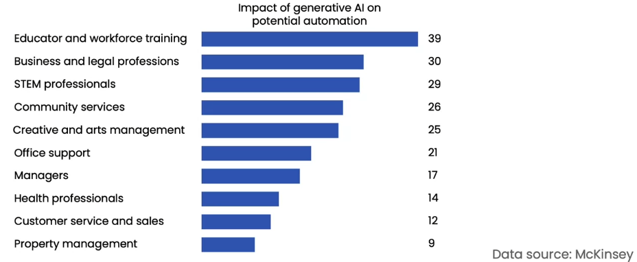
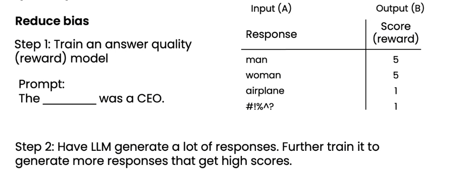

# Generative AI in Business and Society

## Generative AI and business

### Day-to-day usage of web UI LLMs

- Writing assistant
- Marketer
- Recruiter
- Programmer

### Task analysis of jobs

**Identifying automation opportunities**

- AI doesn't automate jobs. It automates tasks.
- Most jobs involve a collection of many tasks.

| Tasks                                     | Generative AI potential |
| ----------------------------------------- | ----------------------- |
| Answer inbound phone calls from customers | Low                     |
| Answer customer chat queries              | High                    |
| check status of customer orders           | Medium                  |
| Keep records of customer interactions     | High                    |
| Assess accuracy of customer complaints    | Low                     |

**Augmentation VS Automation**

**Augmentation**

- Help humans with a task
- E.g., recommend a response for a customer service agent to edit/approve.

**Automation**

- Automatically perform a task
- E.g., automatically transcribe and summarize records of customer interactions

For some tasks, businesses will start with augmentation, and gradually move toward automation.

**Evaluating AI potential**

The potential for augmenting/automating a task depends on:

1. Technical feasibility
2. Business value

**Technical feasibility: Can AI do it?**

- Can a fresh college graduate following the instructions in a prompt complete the tash?
- If unsure, try prompting an LLM to see if you can get it to do it.
- An AI engineer can also help assess if RAG, fine-tuning, or other techniques can help.

**Business value: How valuable is it for AI to augment or automate this task?**

- How much time is spent on this task?
- Does doing this task significantly faster, cheaper or more consistently create substantial value?

**Job databases: Breaking down job roles into tasks**

for **Computer Programmers**

Source: [onetonline.org](https://www.onetonline.org/)

### Additional job analysis examples

**Computer programmer**

| Tasks                           | Generative AI potential |
| ------------------------------- | ----------------------- |
| Write code                      | Medium                  |
| Write documentation             | High                    |
| Respond to use support requests | Medium                  |
| Review others' code             | Low                     |
| Gather requirements             | Low                     |

**Lawyer**

| Tasks                                    | Generative AI potential |
| ---------------------------------------- | ----------------------- |
| Draft and review legal documents         | High                    |
| Interpret laws, rulings, and regulations | High                    |
| Review evidence                          | Low                     |
| Negotiate settlements of disputes        | Low                     |
| Represent clients in court               | Low                     |

### New workflows and new opportunities

**Surgeon**

**Legal documentation review**

**Marketing automation**

**Analyzing customers' tasks**

Example: Helping customers build websites

### Team to build generative AI software

**Common roles**

- Software engineer

  - Responsible for writing software application
  - Ideally someone who has learned basics of LLMs/prompting

- Machine learning engineer

  - Responsible for implementing AI system
  - Ideally familiar with LLMs/prompting, RAG, fine-tuning

- Product manager

  - Responsible for identifying and scoping the project

- Prompt engineer?
  - Usually not hired as a dedicated role

**Getting started with a small team**

One person team:

- Software engineer (who has learned some prompting)
- Machine learning engineer

Two person team:

- Machine learning engineer + software engineer

Additional roles:

- Data engineer: Responsible for organizing data and ensuring data quality
- Data scientist: Responsible for analyzing data to make recommendations to guide project or business decisions
- Project manager: Responsible for coordination project execution
- Machine learning researcher: Responsible for developing advanced AI technologies

### Automation potential across sectors

**Generative AI will impact higher-paid jobs more**

**Analysis by functional role**

**Analysis by industry sector**

## Generative AI and society

### Concerns about AI

**1. Amplifying humanity's worst impulses**

- LLMs are trained on text from the internet, which reflects some of humanity's best qualities, but also some of its worst
- Will it amplify our worst impulses?
- LLMs are becomimg less biased through fine-tuning and more advanced techniques such as Reinforcement Learning from Human Feedback (RLHF)

**Reinforcement learning from human feedback (RLHF)**

**2. Job loss**

Radiologist

| Tasks                                     | AI potential |
| ----------------------------------------- | ------------ |
| Interpret X-rays                          | High         |
| Operate imaging hardware                  | Medium       |
| Communicate exam results                  | Medium       |
| Respond to complications during procedure | Low          |
| Document procedure and outcomes           | Medium       |

### Artificial General Intelligence

**Definition: AI that can do any intellectual task that a human can**

- Learn to drive a car through ~20 hours of practice
- Complete a PhD thesis after ~5 years of work
- Do all the tasks of a computer programmer (or any other knowledge worker)

### Responsible AI

**Dimensions of responsible AI**

- **Fairness:** Ensuring AI does not perpetuate or amplify biases
- **Transparency:** Marking AI systems and their decisions understandable to stakeholders impacted
- **Privacy:** Protecting user data and ensure confidentiality
- **Security:** Safeguard AI systems from malicious attacks
- **Ethical Use:** Ensuring AI is used for beneficial purposes

**Tips for responsible AI**

- Build a culture that encourages discussion and debate on ethical issues
- Brainstorm how things can go wrong
- Work with a diverse team and include perspectives from all stakeholders
