# Introduction to Generative AI

## What is generative AI

### Welcome

**The rise of Generative AI**

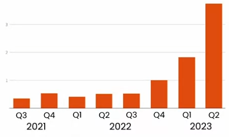

**What generative AI is**

Artificial intelligence systems can produce high quality content, specifically text, image, audio and video.

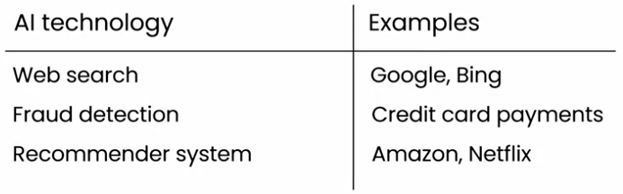

### How Generative AI works

AI is a set of tools

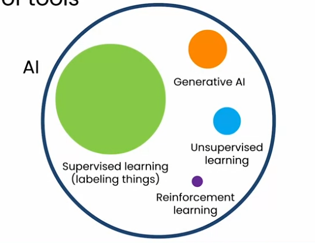

Supervised learning

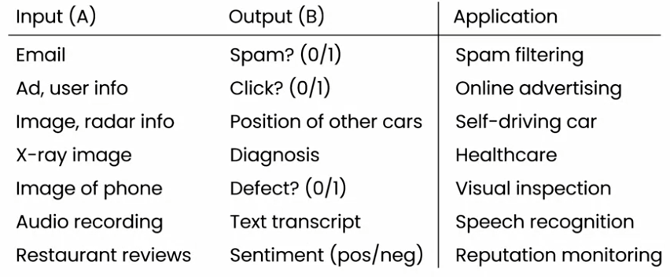

Generating text using Large Language Models (LLMs)

Text generation process

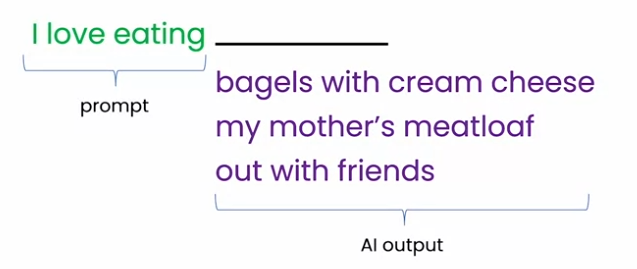

How Large Language Models work

LLMs are built by using supervised learning (A -> B) to repeatedly predict the next word

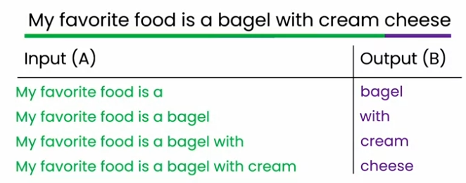

### LLMs as a thought partner

Need to verify authenticity of content

Need contextual cues

### AI is a general purpose technology

Similar to electricity, the Internet, a general purpose technology.

Writing: writing a novel

Reading: Determining whether content is positive or not

Chatting: Chatbots

Web-based vs software application

## Generative AI Applications

### Writing

Content creation: writing sales pitches

Translation：Even better than dedicated translation engines, but performs poorly in low-resource languages

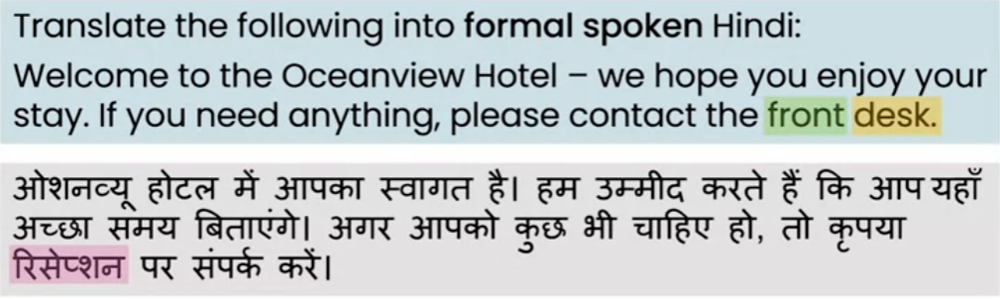

### Reading

Proofreading

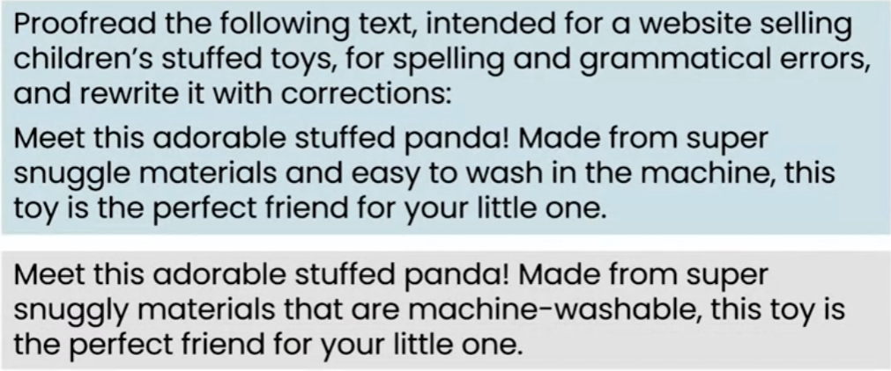

Summarizing an article

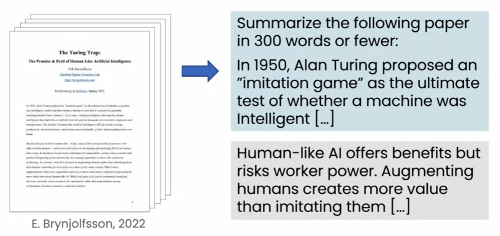

Summarizing conversations

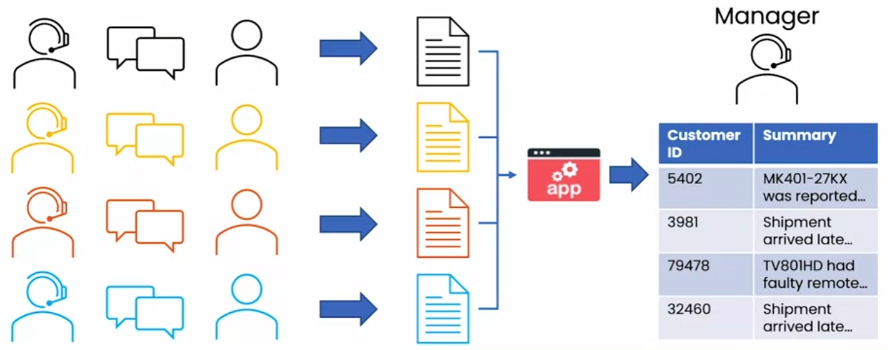

Customer email analysis

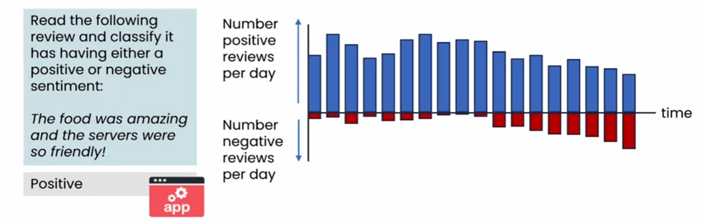

### Chatting

Specialized Chatbots: Provide suggestions or call system APIs to take action

IT Service Chatbot: Authorization and action

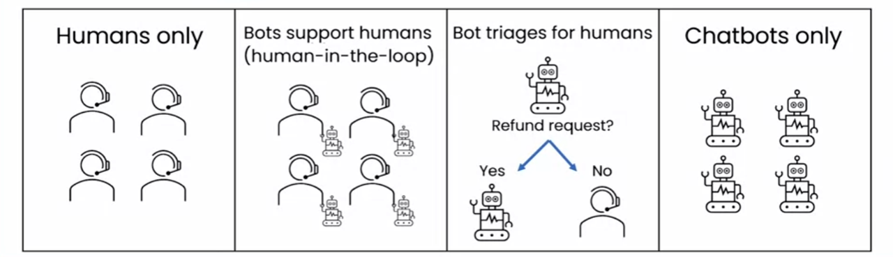

### What LLMs can and cannot do

The ability is equivalent to that of a recent college graduate

- Knowledge base is limited to a point in time
- Responses can be made up
- Prompts and generated responses are limited in length
- Better at handling unstructured data
- May lead to bias

### Tips for prompting

**Be detailed and specific**

Provide background content, describe detailed requirements tasks, require accurate text and professional tone

**Guide the model to think through its answer**

Step 1 ... step N

**Experiment and iterate**

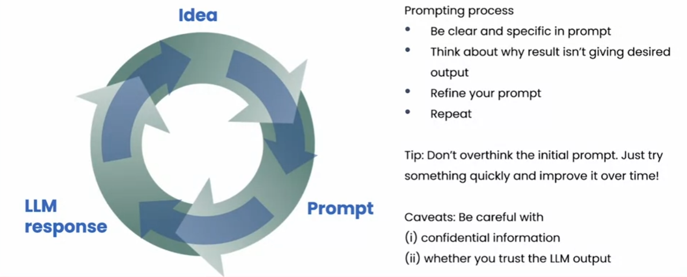

### Image generation

diffusion model

Finding a large number of images from the Internet or elsewhere for learning, the core is supervised learning.

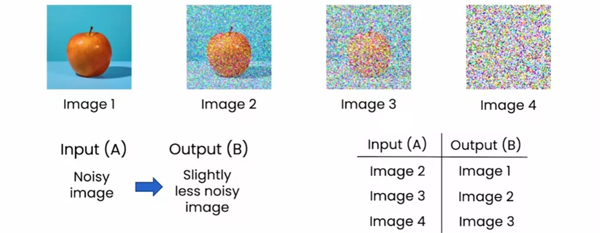

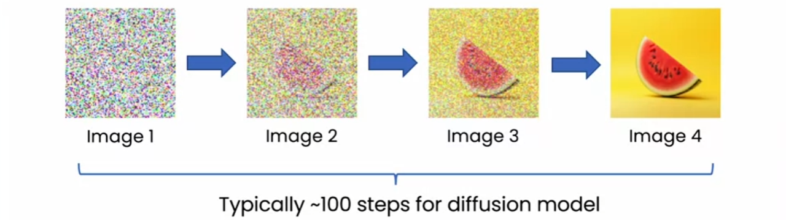
