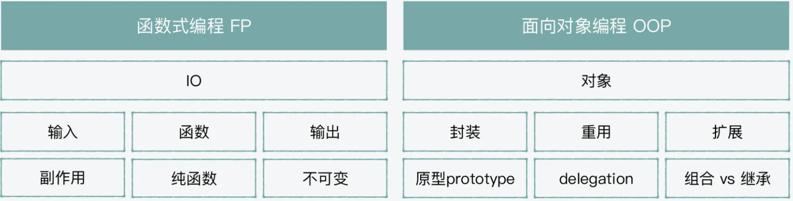
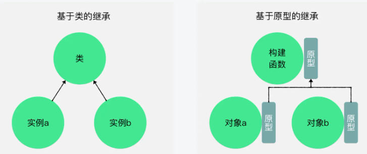

# 函数式 vs.面向对象

从编程模式的角度看 `JavaScript`，它是结构化的、事件驱动的动态语言，且支持声明式和指令式两种模式。所以 `JavaScript` 是一个多模式（multi-paradigm）的语言。

- 面向对象（OOP object oriented programming）
- 函数式（FP functional programming）
  

## 函数式编程

### 函数是什么、如何使用？

一个函数由输入、函数和输出组成。函数是数据集到目标的一种关系，它所做的就是把行为封装起来，从而达到目标。

```javascript
function add(a, b) {
  return a + b;
}
add(1, 2); // return 3
```

### 函数中的副作用

不可控的外部环境：

#### 全局变量（global variable）

```javascript
var x = 1;
foo();
console.log(x);
bar();
console.log(x);
baz();
console.log(x);
```

#### IO 影响（IO effects）

- 前端浏览器中的用户行为：鼠标和键盘的输入
- 服务器端：`Node` 的文件系统、网络连接以及 `stream` 的 `stdin`（标准输入）和 `stdout`（标准输出）

#### 网络请求（HTTP request）

网络环境影响

### 减少副作用：纯函数和不可变

纯函数：一个函数的返回结果的变化只依赖其参数，并且执行过程中没有副作用

纯函数可以通过减少对外界不确定因素的依赖，来减少副作用

```javascript
var a = 1;
function add(b) {
  return a + b;
}
add(2); // return 3
```

不可变：在减少程序被外界影响的同时，也减少对外界的影响

```javascript
const beforeList = [1, 2, 3, 4];
console.log(beforeList.splice(0, 2));
console.log(beforeList.splice(0, 2));
//[ 1, 2 ]
//[ 3, 4 ]

const beforeList = [1, 2, 3, 4];
console.log(beforeList.slice(0, 2));
console.log(beforeList.slice(0, 2));
//[ 1, 2 ]
//[ 1, 2 ]
```

**纯函数**对值只影响一次，是幂等的。**不可变**完全不影响

## 面向对象编程

### 对象是什么、如何创建？

工具和方法通常是服务于对象的。

```javascript
var dog = {
  name: 'kk',
  identify: function() {
    return 'This is' + this.name;
  },
};

console.log(dog.name); // 返回 "kk"
console.log(dog.identify()); // 返回 "This is kk"
```

### 为什么需要封装、重用和继承？

用来组成生产关系

#### 封装

相同的模块（module）或组件（ component）

#### 重用

把可以重复使用的功能抽象到一个类里，每次只是创建一个它的实例对象来使用。

#### 继承

通过继承将一些特定的行为或属性放到子类中，在继承了基础的父类（parent class）功能的基础上（extend），还能够在子类（child class）中作一些改动。

### 基于原型的继承

传统的面向对象的编程语言：一个对象基于一个类的蓝图来创建，拥有类和对象的拷贝从属关系。

JavaScript：对象和类之间是原型链接关系。

ES6+ 中的类

```javascript
class Dog {
  constructor() {
    // specify here
  }
  say() {
    console.log('say hello');
  }

  run() {
    console.log('run ~~');
  }
}

var dog1 = new Dog();

dog1.say();
dog1.run();
```

基于原型链的继承

```javascript
function Animal(name) {
  this.name = name;
}

Animal.prototype.say = function() {
  return 'say ' + this.name;
};

function Dog(name) {
  Animal.call(this, name);
}

Dog.prototype = Object.create(Animal.prototype);

Dog.prototype.run = function() {
  console.log('run, ' + this.say() + '.');
};

var dog1 = new Dog('kk');
var dog2 = new Dog('jj');

Object.getPrototypeOf(dog1) === Dog.prototype; //true
Object.getPrototypeOf(dog2) === Dog.prototype; //true

dog1.run(); // "run, say kk"
dog2.run(); // "run, say jj"
```
