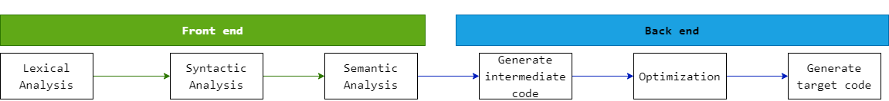

# Getting Started

## Front end

> Implement a scripting language

1. Lexical Analysis
   1. Token
      1. keyword
         1. if
         2. else
         3. for
      2. Identifier
         1. name
         2. age
         3. sum
      3. Operator
         1. +
         2. -
         3. =
      4. Symbol
         1. {
         2. (
         3. ;
      5. Literal
         1. 'hello world'
         2. 123
2. Syntactic Analysis / Parsing
   1. Abstract Syntax Tree (AST)
      1. [AST Demo](https://resources.jointjs.com/demos/javascript-ast)
   2. tools
      1. Yacc
      2. Antlr
3. Semantic Analysis
   1. Conversion of data type of expression calculation result
   2. Variables with the same name outside and inside the code block
   3. Unique variable name in the same scope

## Back end

> Generate executable files

1. Generate intermediate code
2. Optimization
3. Generate target code
