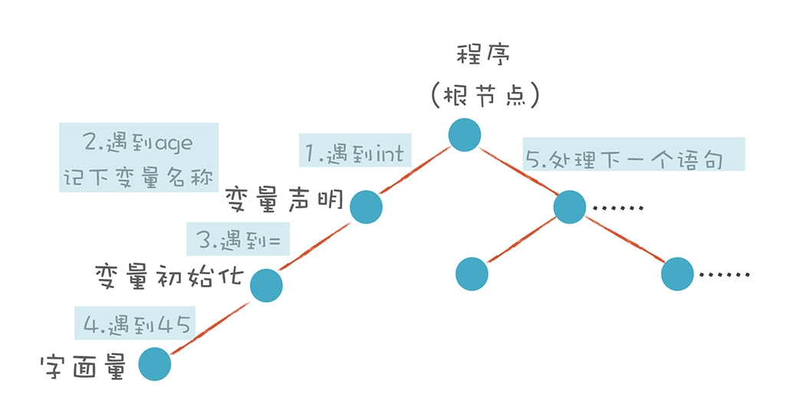

# Syntactic Analysis

## Recursive Descent Parsing

`int age = 45`

解析变量声明语句和表达式的算法分别写成函数。在语法分析的时候，调用这些函数跟后面的 Token 串做模式匹配。匹配上了，就返回一个 AST 节点，否则就返回 null。如果中间发现跟语法规则不符，就报编译错误。

## Context-free Grammar (CFG)

无论在任何情况下，文法的推导规则都是一样的。在变量声明语句中可能要用到一个算术表达式来做变量初始化，在其他地方可能也会用到算术表达式。算术表达式的语法都一样，都允许用加法和乘法，计算优先级也不变。
