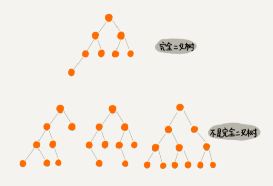

# 二叉树

## 一、树（Tree）

- 父节点
- 子节点
- 兄弟节点
- 节点高度：节点到叶子节点的最长路径（边数）
- 节点深度：根节点到这个节点所经历的边数
- 节点层数：节点深度+1
- 数高度：根节点高度

## 二、二叉树（Binary Tree）

- 每个节点最多有两个子节点，分别是左子节点和右子节点。
- 叶子节点全都在最底层，除了叶子节点之外，每个节点都有左右两个子节点，这种二叉树就叫做满二叉树。

