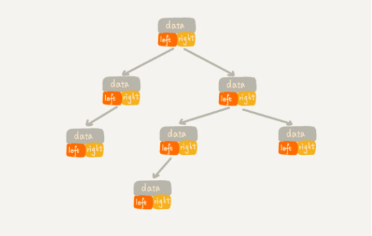
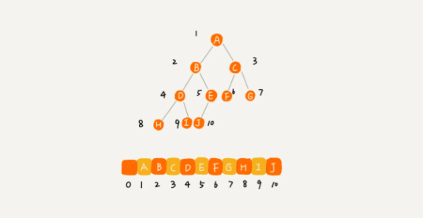
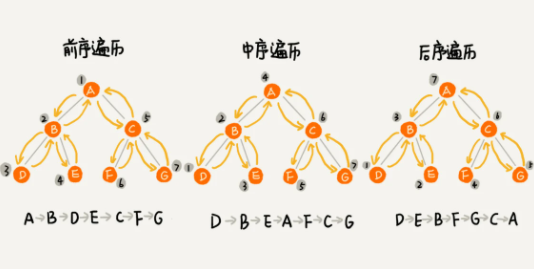
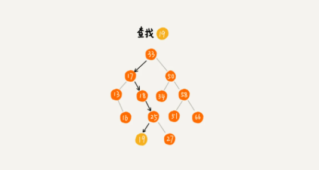
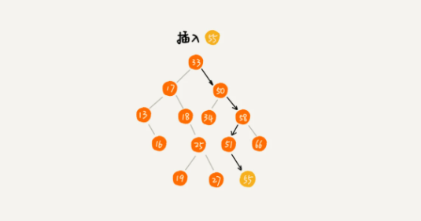
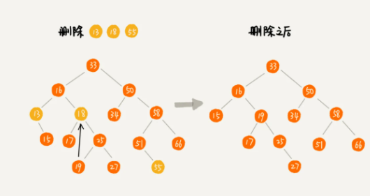

# Binary Tree

## Tree

- 父节点
- 子节点
- 兄弟节点
- 根节点
- 叶子节点
- 节点 Height：节点到叶子节点的最长路径（边数）
- 节点 Depth：根节点到这个节点所经历的边数
- 节点 Level：节点 depth+1
- 树高度：根节点高度

## Binary Tree

- 每个节点最多有两个子节点，分别是左子节点和右子节点。
- 满二叉树：叶子节点全都在最底层，除了叶子节点之外，每个节点都有左右两个子节点。
- 完全二叉树：叶子节点都在最底下两层，最后一层的叶子节点都靠左排列，并且除了最后一层，其他层的节点个数都要达到最大。

## Binary Tree Traversal

- 前序遍历：对于树中的任意节点来说，先打印这个节点，然后再打印它的左子树，最后打印它的右子树。
- 中序遍历：对于树中的任意节点来说，先打印它的左子树，然后再打印它本身，最后打印它的右子树。
- 后续遍历：对于树中的任意节点来说，先打印它的左子树，然后再打印它的右子树，最后打印这个节点本身。
  

## Binary Search Tree

- 支持快速查找、插入、删除一个数据。
- 在树中的任意一个节点，其左子树中的每个节点的值，都要小于这个节点的值，而右子树节点的值都大于这个节点的值。

### Find a element

### Insert a element

### Delete a element

### Other

- 快速地查找最大节点和最小节点、前驱节点和后继节点。
- 中序遍历二叉查找树，可以输出有序的数据序列，时间复杂度是 O(n)
