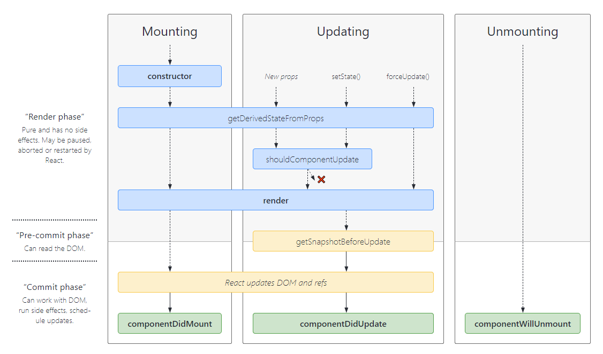

# React 基础

## 1. 历史背景及特性

简单功能易出现 bug

- 传统 DOM API 需要关注太多细节：局部刷新 -- React：整体刷新
- 传统 MVC 操作关系混乱 -- Flux 架构：单向数据流（Redux， Mobx）

## 2. 使用组件构建 UI

props + state => View

1. 组件一般不提供方法，而是某种状态机
2. 纯函数
3. 单向数据绑定

### 受控组件

元素状态由使用者维护

### 非受控组件

元素状态由组件自身维护

### 组件：单一职责原则

1. 每个组件只做一件事
2. 如果组件复杂就拆分

### 数据状态管理：DRY 原则

1. 能够计算得到的状态就不要单独存储
2. 组件尽量无状态，数据从 props 获取

## 3. JSX

JSX 本质是动态创建组件的语法糖

1. JSX 本身也是表达式
2. 在属性中使用表达式
3. 延展属性
4. 表达式作为子元素

### 优点

1. 直观：声明式创建界面
2. 灵活：代码动态创建界面
3. 无需学习新的模板语言

> 约定：自定义组件首字母大写

## 4. 组件的生命周期及使用场景

### constructor

1. 初始化内部状态，很少用
2. 唯一可以直接修改 state 的地方：this.state.xxx = xxx

### getDerivedStateFromProps

1. state 从 props 初始化
2. 每次 render 都会调用
3. 场景：表单控件获取默认值

### componentDidMount

1. UI 渲染完成后调用
2. 只执行一次
3. 场景：获取外部资源

### componentWillUnmount

1. 组件移除时调用
2. 场景：资源释放

### getSnapshotBeforeUpdate

1. 页面 render 之前调用，state 已更新
2. 获取 render 之前的 DOM 状态

### componentDidUpdate

1. 每次 UI 更新是调用
2. 场景：页面根据 props 的变化重新获取数据

### shouldComponentUpdate

1. 决定 Virtual DOM 是否要重绘
2. 可由 pureComponent 自动实现
3. 场景：性能优化

## 5. Virtual DOM 及 Key

### 广度优先分层比较

> 算法复杂度 O(n)

1. 组件的 DOM 结构相对稳定
2. 类型相同的兄弟节点可以被唯一标识

## 6. 组件设计模式

### 高阶组件

1. 需要多级组件传参
2. 附加额外逻辑
3. 不做 UI 展示

### 函数作为子组件

1. 场景灵活

## 7. Context API

1. 可以多层级传递属性
2. React 自动监听变化做组件刷新

## 8. Create React App tools

### Why

React, Redux, React/Router, Babel, webpack, ESLint

### Create React App

官方出品，推荐主流，入门使用

### Rekit

额外增加 Less/Scss, Feature, IDE

### CodeSandbox

1. online:codesandbox.io
2. webpack 运行在网页端

## 9. Build & Deploy

### Why

1. 编译 ES6 语法特性，编译 JSX
2. 整合资源：image，Less/Scss
3. 优化代码体积：缩短变量名，去除空格/注释，

### webpack

通过 loader 拥有各种资源整合能力

### 注意事项

1. 设置 nodejs 环境为 production
2. 禁用开发时专用代码：log
3. 设置应用根路径
