import RainbowText from '@site/src/components/RainbowText';

# 生成式人工智能项目

## 软件应用

### 在软件应用中使用生成式人工智能

餐厅声誉监控的监督学习

利用监督学习，收集大量数据，对其进行标注，AI 团队基于这些数据训练 AI 模型，并将其部署到云服务器。

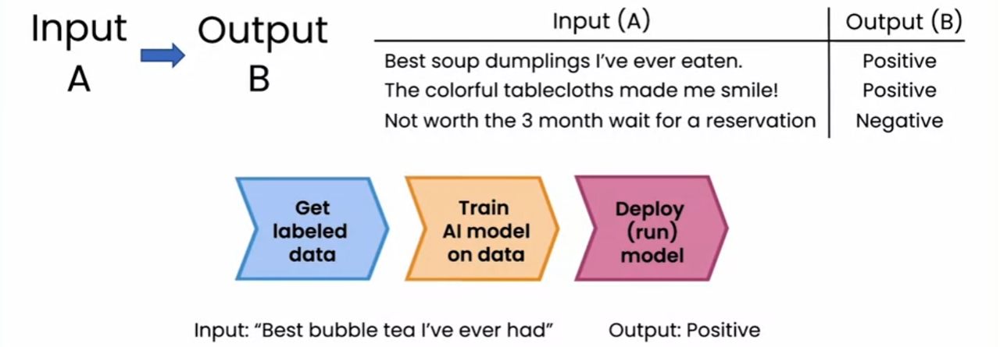

基于提示的开发

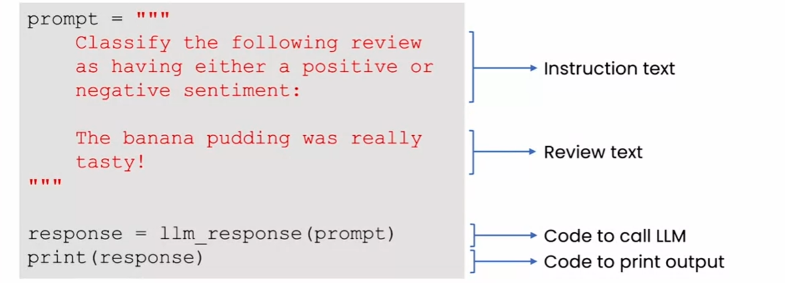

### 亲自尝试生成式人工智能代码

[活动](https://learn.deeplearning.ai/genai4e/lesson/1/activity1)

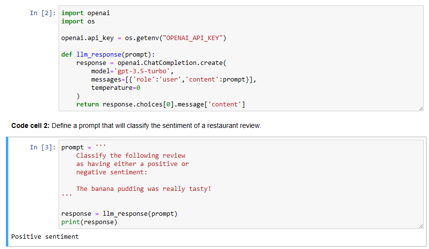

### 生成式人工智能项目的生命周期

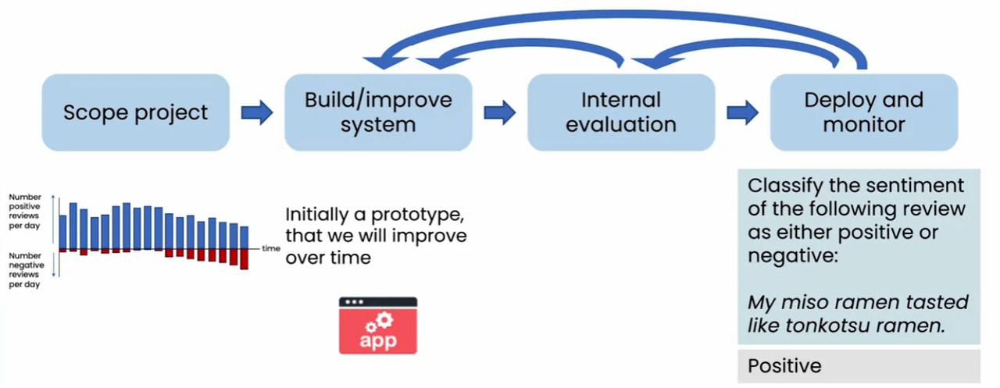

成本直觉

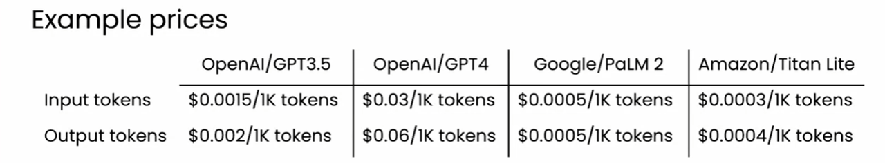

什么是令牌？

- <RainbowText texts={[{content: 'hello world'}]} /> 1 token
- <RainbowText texts={[{content: 'tran'}, {content: 'slate'}]} /> 2 tokens
- <RainbowText texts={[{content: 'ton'}, {content: 'k'}, {content: 'ots'}, {content: 'u'}]} /> 4 tokens

  大致而言，1 个令牌 = 3/4 个单词

## 高级技术：超越提示

### 检索增强生成（RAG）

通过提供超越互联网或其他开放来源的数据，显著扩展能力。

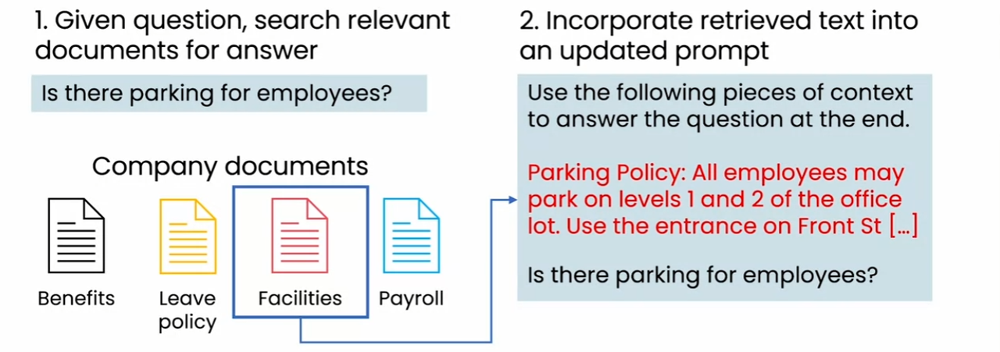

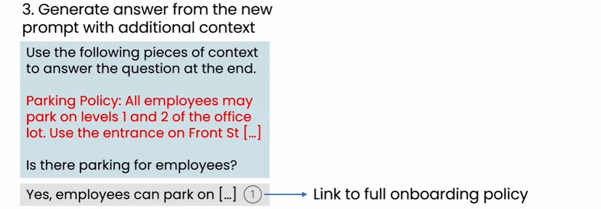

LLM 作为推理引擎

### 微调

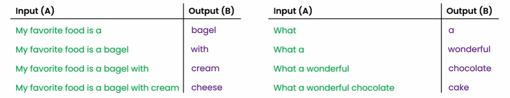

- 以特定风格或结构概括
- 模仿写作或言语风格

微调：帮助 LLM 获得特定知识

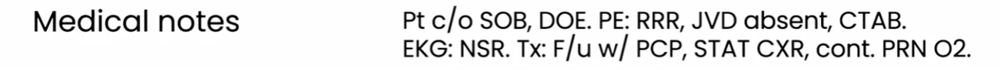

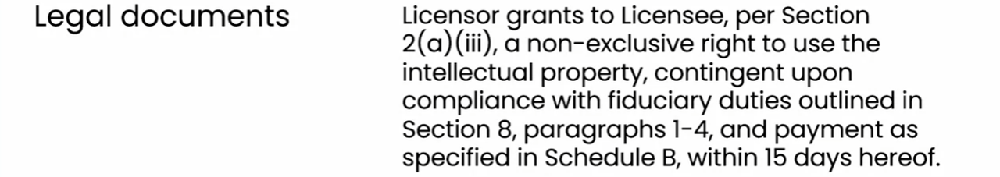

### 预训练 LLM

非常昂贵，但有效。

### 选择模型

模型大小：
| 大小 | 描述 | 用例 |

| 1B 参数 | 模式匹配和对世界的基本了解 | 餐厅评论情感|
| 10B 参数 | 更广泛的世界知识。可以遵循基本指令。 | 食品订购聊天机器人|
| 100B+ | 丰富的世界知识。复杂的推理。 | 创意伙伴|

封闭或开源：

封闭源模型（云编程接口）
开源模型

- 在应用中易于使用
- 更大/更强大的模型
- 相对便宜
- 一些供应商锁定的风险
- 对模型拥有完全控制
- 可在自己的设备上运行（本地，PC 等）
- 对数据隐私/访问有完全控制
  LLM 如何遵循指令

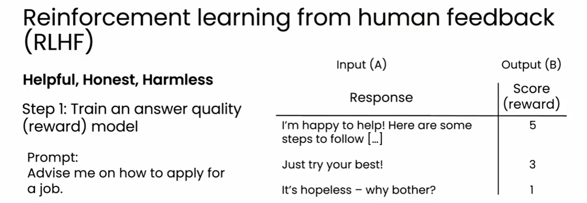

工具使用和代理

用于食品订单接收的工具

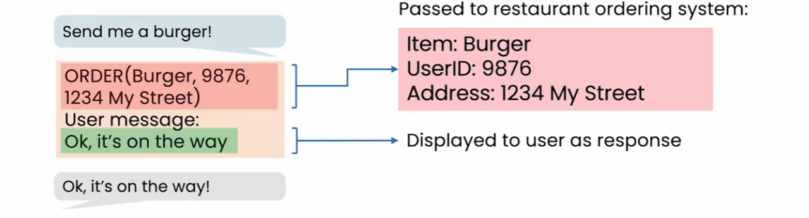

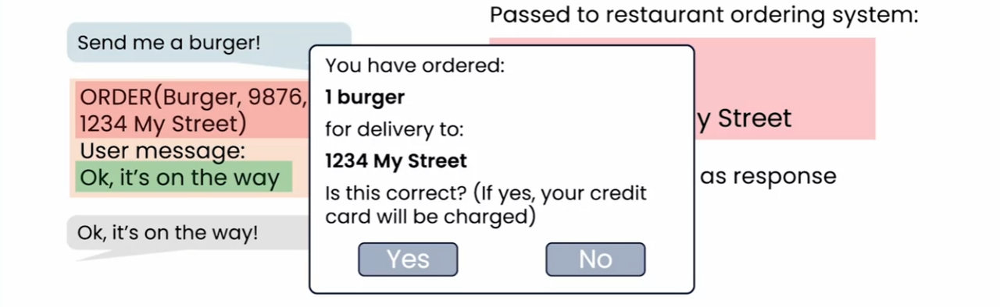

推理工具

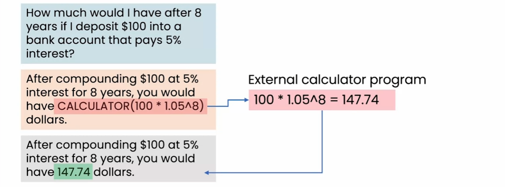

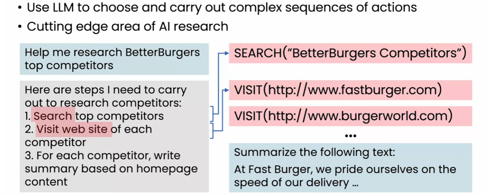
