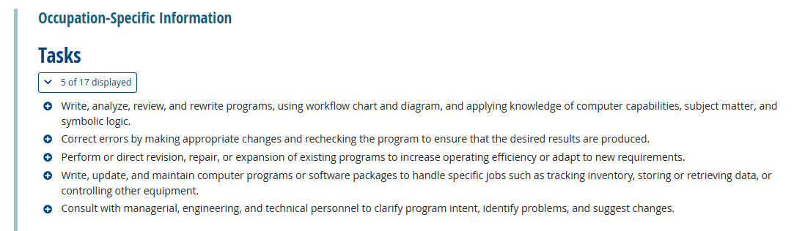
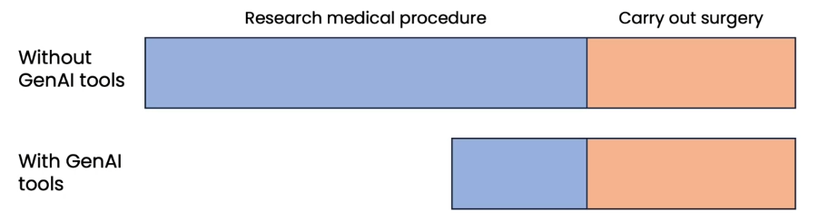
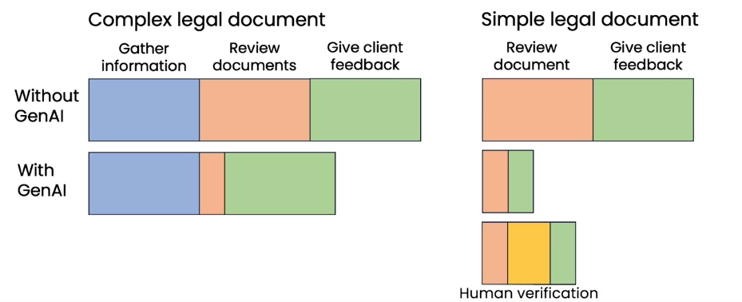
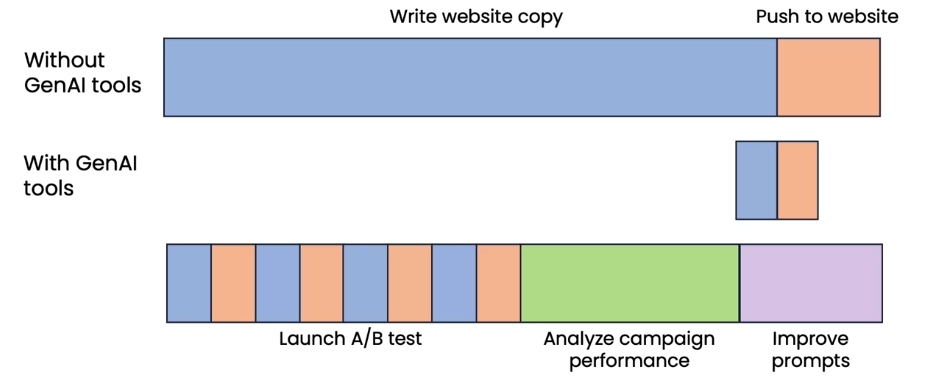
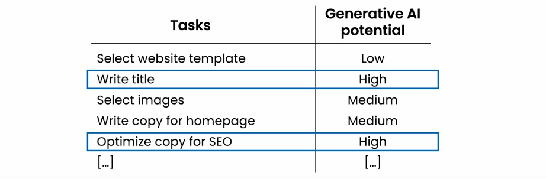
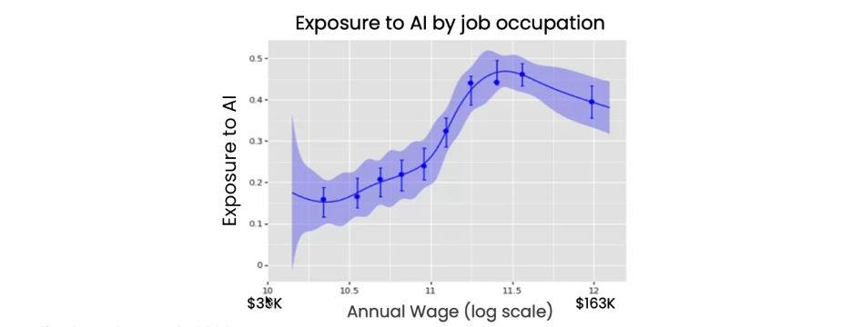
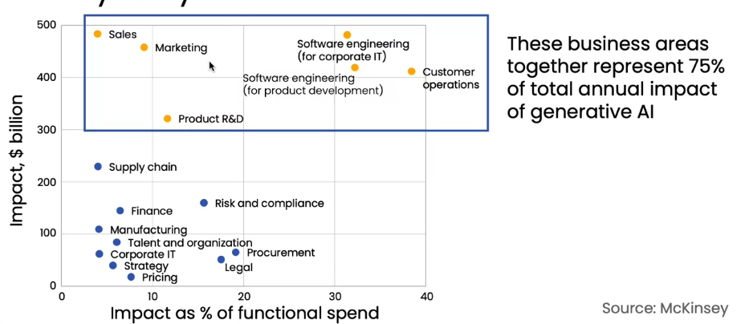
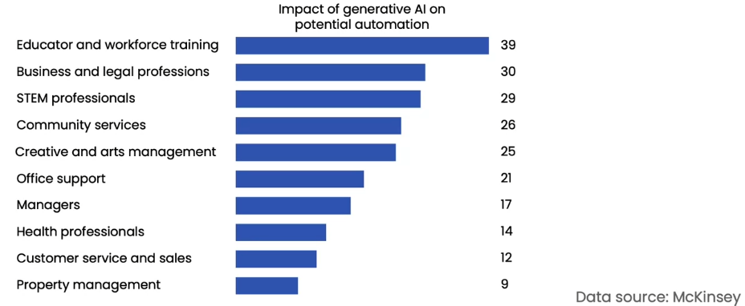
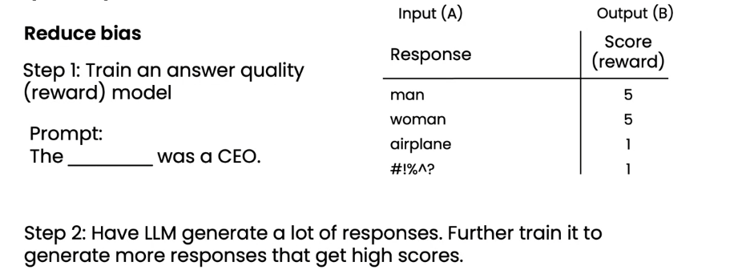

# 生成式人工智能在商业和社会中的应用

## 生成式人工智能与业务

### Web UI LLMs 的日常使用

- 写作助手
- 营销人员
- 招聘人员
- 程序员

### 工作任务分析

**识别自动化机会**

- 人工智能不是自动化工作，而是自动化任务。
- 大多数工作涉及执行许多任务。

| 任务                 | 生成式人工智能潜力 |
| -------------------- | ------------------ |
| 接听客户的来电       | 低                 |
| 回答客户聊天查询     | 高                 |
| 检查客户订单状态     | 中                 |
| 记录客户互动         | 高                 |
| 评估客户投诉的准确性 | 低                 |

**增强 VS 自动化**

**增强**

- 帮助人类完成任务
- 例如，为客服代理建议编辑/批准的响应。

**自动化**

- 自动执行任务
- 例如，自动转录和总结客户互动记录

对于一些任务，业务将从增强开始，逐渐过渡到自动化。

**评估 AI 潜力**

增强/自动化任务的潜力取决于：

1. 技术可行性
2. 商业价值

**技术可行性：AI 能做到吗？**

- 一个刚毕业的大学生是否能按提示完成任务？
- 如果不确定，尝试提示 LLM 看看是否能完成。
- AI 工程师还可以帮助评估 RAG、微调或其他技术是否有助于解决问题。

**商业价值：AI 增强或自动化此任务有多有价值？**

- 在这个任务上花费了多少时间？
- 是否更快、更便宜或更一致地完成此任务能够创造实质性的价值？

**职业数据库：将职业角色拆分成任务**

对于**计算机程序员**

来源：[onetonline.org](https://www.onetonline.org/)

### 其他职位分析示例

**计算机程序员**

| 任务             | 生成式人工智能潜力 |
| ---------------- | ------------------ |
| 编写代码         | 中                 |
| 编写文档         | 高                 |
| 回应用户支持请求 | 中                 |
| 查看他人的代码   | 低                 |
| 收集需求         | 低                 |

**律师**

| 任务                 | 生成式人工智能潜力 |
| -------------------- | ------------------ |
| 起草和审查法律文件   | 高                 |
| 解释法律、裁决和法规 | 高                 |
| 查看证据             | 低                 |
| 谈判解决争端         | 低                 |
| 代表客户出庭         | 低                 |

### 新工作流程和新机会

**外科医生**

**法律文件审查**

**营销自动化**

**分析客户任务**

示例：帮助客户建立网站

### 建立生成式人工智能软件的团队

**常见角色**

- 软件工程师

  - 负责编写软件应用程序
  - 最好是已经学习了 LLMs/提示的基础知识

- 机器学习工程师

  - 负责实施 AI 系统
  - 最好熟悉 LLMs/提示、RAG、微调

- 产品经理

  - 负责确定和范围化项目

- 提示工程师？
  - 通常不会作为专职角色雇佣

**从小团队开始**

一人团队：

- 软件工程师（已学习了一些提示的人）
- 机器学习工程师

两人团队：

- 机器学习工程师 + 软件工程师

附加角色：

- 数据工程师：负责组织数据并确保数据质量
- 数据科学家：负责分析数据以提供建议，指导项目或业务决策
- 项目经理：负责协调项目执行
- 机器学习研究员：负责开发先进的人工智能技术

### 跨行业的自动化潜力

**生成式人工智能将更多地影响高薪工作**

**按功能角色分析**

**按行业部门分析**

## 生成式人工智能与社会

### 对人工智能的担忧

**1. 放大人性的最坏冲动**

- LLMs 受到互联网上的文本训练，反映了人类的优秀品质，但也反映了最坏的品质
- 它会放大我们最坏的冲动吗？
- 通过微调和更先进的技术，如来自人类反馈的强化学习（RLHF），LLMs 正变得越来越不偏颇

**从人类反馈中进行强化学习（RLHF）**

**2. 就业问题**

放射科医师

| 任务               | AI 潜力 |
| ------------------ | ------- |
| 解释 X 射线        | 高      |
| 操作成像设备       | 中      |
| 沟通检查结果       | 中      |
| 处理程序中的并发症 | 低      |
| 记录程序和结果     | 中      |

### 人工通用智能

**定义：能够执行人类可以执行的任何智力任务的人工智能**

- 通过约 20 小时的实践学会开车
- 在约 5 年的工作后完成博士论文
- 完成计算机程序员（或任何其他知识工作者）的所有任务

### 负责任的人工智能

**负责任人工智能的维度**

- **公正性：** 确保 AI 不会持续或放大偏见
- **透明度：** 使 AI 系统及其决策对受影响的利益相关者可理解
- **隐私：** 保护用户数据并确保机密性
- **安全：** 保护 AI 系统免受恶意攻击
- **道德用途：** 确保 AI 用于有益目的

**负责任 AI 的建议**

- 建立鼓励对伦理问题进行讨论和辩论的文化
- 思考事物可能出错的方式
- 与多元化团队合作，并纳入所有利益相关者的观点
