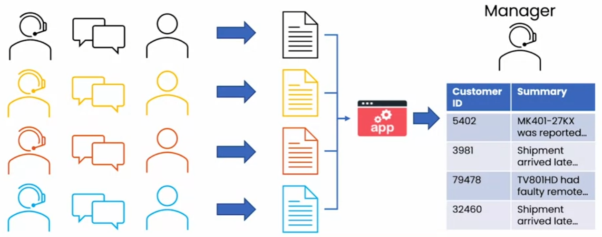

# 生成式人工智能简介

## 什么是生成式人工智能

### 欢迎

**生成式人工智能的崛起**

**生成式人工智能是什么**

人工智能系统可以生成高质量的内容，特别是文本、图像、音频和视频。

### 生成式人工智能的工作原理

人工智能是一组工具

监督学习

使用大型语言模型（LLMs）生成文本

文本生成过程

大型语言模型的工作原理

通过使用监督学习（A -> B）来重复预测下一个词构建 LLMs

### LLMs 作为思维伙伴

需要验证内容的真实性

需要上下文线索

### 人工智能是通用技术

类似于电力、互联网，是一种通用技术。

写作：写一部小说

阅读：判断内容是否积极

聊天：聊天机器人

基于 Web 的与软件应用

## 生成式人工智能应用

### 写作

内容创作：写销售演讲稿

翻译：甚至比专用翻译引擎更好，但在资源匮乏的语言中表现较差

### 阅读

校对

文章摘要

对话摘要

客户电子邮件分析

### 聊天

专用聊天机器人：提供建议或调用系统 API 执行操作

IT 服务聊天机器人：授权和操作

### LLMs 能做和不能做的事情

能力相当于最近的大学毕业生

- 知识库有限于某个时间点
- 回答可以是虚构的
- 提示和生成的回答长度有限
- 更擅长处理非结构化数据
- 可能导致偏见

### 提示的技巧

**详细和具体**

提供背景内容，描述详细的任务需求，要求准确的文本和专业的语气

**引导模型思考其答案**

步骤 1... 步骤 N

**实验和迭代**

### 图像生成

扩散模型

从互联网或其他地方找到大量图像进行学习，核心是监督学习。

